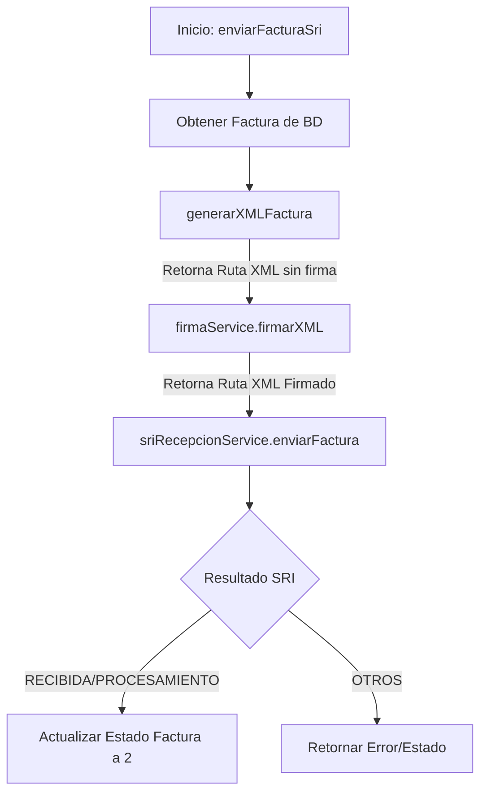

# Guía Técnica: Generación y Firma de XML para Facturación Electrónica

Este documento detalla el proceso técnico de generación, firma y envío de facturas electrónicas (XML) implementado en el sistema.

## 1. Flujo General del Proceso

El proceso completo se orquesta principalmente en `FacturaServicio.java` dentro del método `enviarFacturaSri`.

## 2. Generación del XML (`FacturaServicio.java`)

La generación del XML no utiliza librerías de mapeo automático (como JAXB), sino que construye el documento **manualmente** utilizando la API DOM de Java (`javax.xml.parsers.DocumentBuilder`).

### Método: `generarXMLFactura(Factura factura)`

Este método realiza los siguientes pasos:

1.  **Inicialización del Documento**:
    *   Crea un `DocumentBuilder` y un nuevo `Document` vacío.
    *   Crea el elemento raíz `<factura>` con atributos `id="comprobante"` y `version="1.1.0"`.

2.  **Construcción de Bloques XML**:
    El XML se divide en varias secciones estándar del SRI:

    *   **`<infoTributaria>`**:
        *   Contiene datos de la empresa emisora (RUC, Razón Social, Dirección Matriz).
        *   Incluye la **Clave de Acceso** y el **Secuencial**.
        *   Define el ambiente (1: Pruebas, 2: Producción) y tipo de emisión.

    *   **`<infoFactura>`**:
        *   Datos de la transacción: Fecha emisión, identificación del comprador, totales.
        *   **Cálculo de Impuestos Agrupados**:
            *   El código recorre todos los detalles de la factura.
            *   Agrupa y suma las bases imponibles por `codigoPorcentaje` (ej. 12%, 0%).
            *   Genera un bloque `<totalImpuesto>` por cada tarifa distinta encontrada.
            *   Calcula el `importeTotal` (Total Factura).
        *   **Pagos**:
            *   Genera el bloque `<pagos>` con la forma de pago, total, plazo y unidad de tiempo.

    *   **`<detalles>`**:
        *   Itera sobre la lista de productos (`factura.getDetalles()`).
        *   Por cada producto crea un `<detalle>` con:
            *   Código principal, descripción, cantidad, precio unitario, descuento.
            *   Sub-bloque `<impuestos>` específico para ese ítem.
            *   Sub-bloque `<detallesAdicionales>` si existen.

    *   **`<infoAdicional>`** (Opcional):
        *   Campos libres tipo "Observaciones", "Email", etc.

3.  **Escritura en Disco**:
    *   Utiliza un `Transformer` para convertir el objeto DOM en un archivo físico.
    *   **Ruta de salida**: `C:\facturaSRI\factura_[CLAVE_ACCESO].xml`

## 3. Firma Electrónica (`FirmaElectronicaServicio.java`)

Una vez generado el XML "crudo", debe ser firmado digitalmente bajo el estándar **XAdES-BES**.

### Método: `firmarXML(rutaXml, rutaFirma, claveFirma)`

1.  **Carga de Credenciales**:
    *   Abre el archivo `.p12` (PKCS12) usando la contraseña proporcionada.
    *   Extrae la `PrivateKey` y el certificado `X509Certificate`.

2.  **Configuración de la Firma**:
    *   Lee el archivo XML generado en el paso anterior.
    *   Crea un objeto `XMLSignature`.
    *   Aplica las transformaciones requeridas:
        *   `TRANSFORM_ENVELOPED_SIGNATURE`: La firma se incluye dentro del mismo XML.
        *   `TRANSFORM_C14N_OMIT_COMMENTS`: Canonicalización.

3.  **Estructura XAdES-BES**:
    Construye manualmente los nodos requeridos por el estándar XAdES:
    *   `QualifyingProperties`
    *   `SignedProperties`
    *   `SigningTime`: Fecha y hora de la firma.
    *   `SigningCertificate`: Hash y serial del certificado usado.

4.  **Generación de Archivo Firmado**:
    *   Incrusta el bloque de firma (`<ds:Signature>`) en el XML.
    *   Guarda el nuevo archivo en: `C:\facturaSRI\factura_[CLAVE_ACCESO]_firmado.xml`.

## 4. Ubicación de Archivos

El sistema utiliza rutas absolutas en el sistema de archivos local (Windows):

| Tipo de Archivo | Ruta |
| :--- | :--- |
| **XML Generado** | `C:\facturaSRI\factura_[CLAVE].xml` |
| **XML Firmado** | `C:\facturaSRI\factura_[CLAVE]_firmado.xml` |
| **PDF RIDE** | `C:\facturas_pdf\factura_[CLAVE].pdf` |

> **Nota**: Asegúrese de que la aplicación tenga permisos de escritura en el disco C: o cambie estas rutas en `application.properties` si es necesario.
